## Проект: Настройка CI/CD с использованием GitLab Runner
**Цель:** Автоматизация процессов сборки, тестирования и деплоя проекта с настройкой уведомлений о состоянии пайплайна.

## 1. Установка и настройка GitLab Runner
- Контейнер с **Ubuntu Server 22.04 LTS** развернут.
- **GitLab Runner** установлен, запущен и зарегистрирован для текущего проекта.
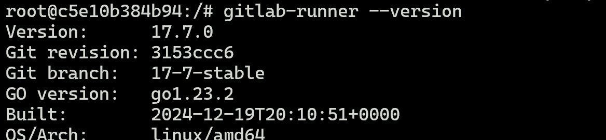

## 2. Настройка пайплайна
- Пайплайн успешно выполняется и отображает корректные результаты работы.  
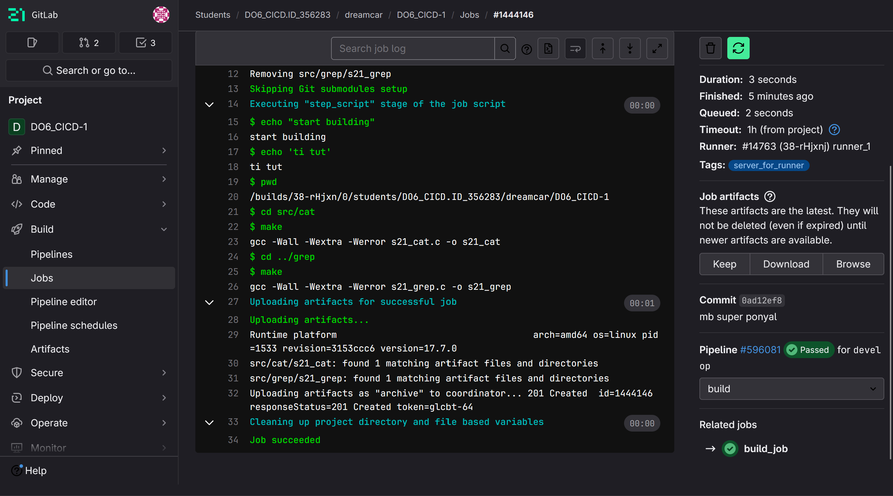

## 3. Обработка ошибок и условные зависимости
- В пайплайне настроена логика, согласно которой вторая джоба запускается только в случае неудачного выполнения первой.
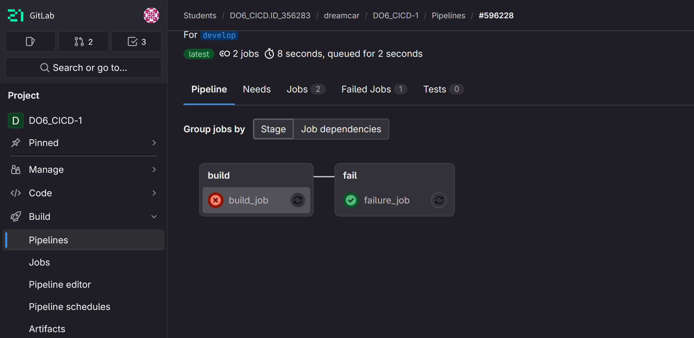

## 4. Проверка код-стайла
- В пайплайн добавлен этап проверки код-стайла с использованием `clang-format`.
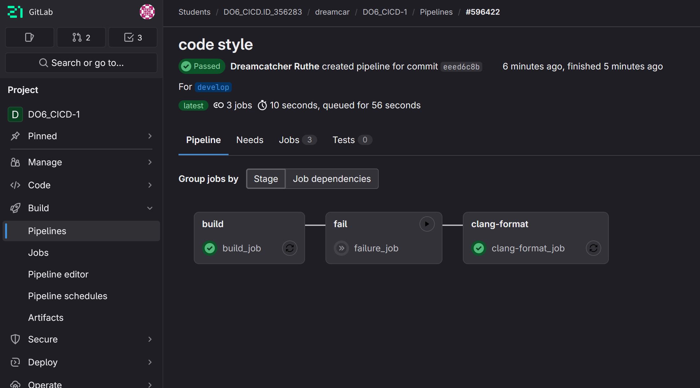
- В случае несоответствия код-стайлу выполнение пайплайна прерывается.  
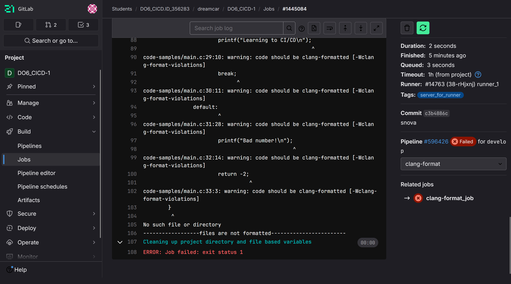

## 5. Интеграционные тесты
- В пайплайн добавлен этап запуска интеграционных тестов.
- Тестирование проводится после успешного выполнения этапов сборки и проверки код-стайла. 
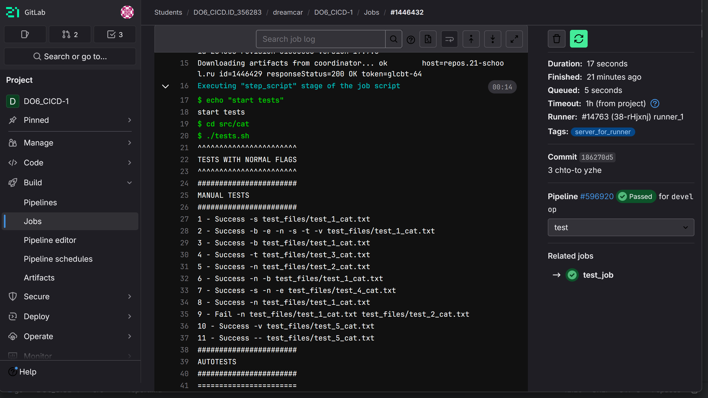
- Вывод тестов отображается в пайплайне.
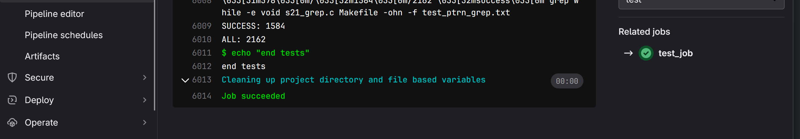

## 6. Деплой на удаленный сервер
- Развернут второй контейнер с **Ubuntu Server 22.04 LTS**.
- Реализован этап деплоя, который выполняется вручную после успешного прохождения всех предыдущих этапов.
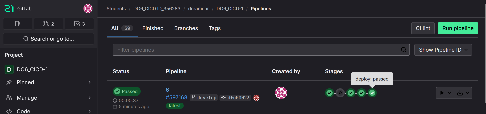
- Перенос артефактов осуществляется с использованием **SSH** и **SCP**.
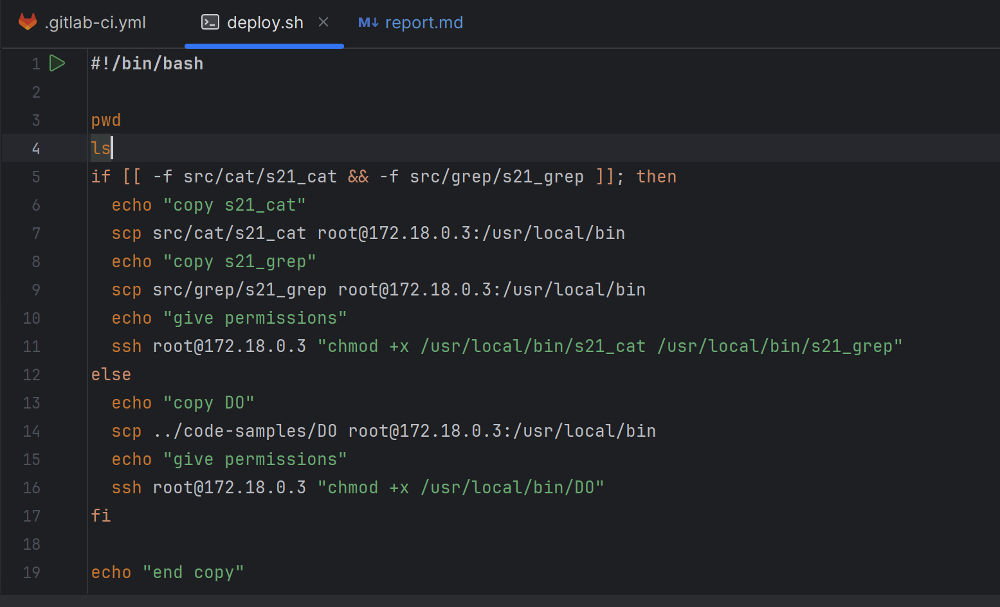
- Сами артефакты на втором контейнере.
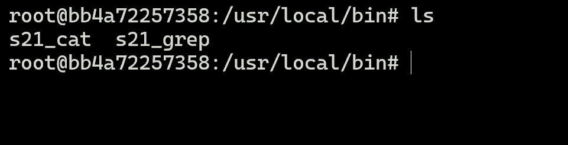

## 7. Уведомления о статусе пайплайна
- Настроена интеграция с Telegram для отправки уведомлений о состоянии пайплайна.
- В случае неудачного выполнения пайплайна отправляется соответствующее уведомление.
- В случае успешного выполнения пайплайна также отправляется уведомление.
  
- **Пайплайн завершился с ошибкой:**  
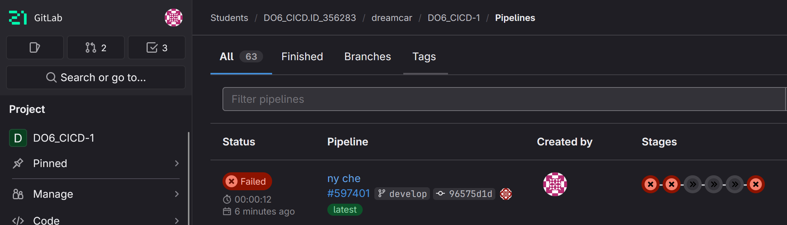
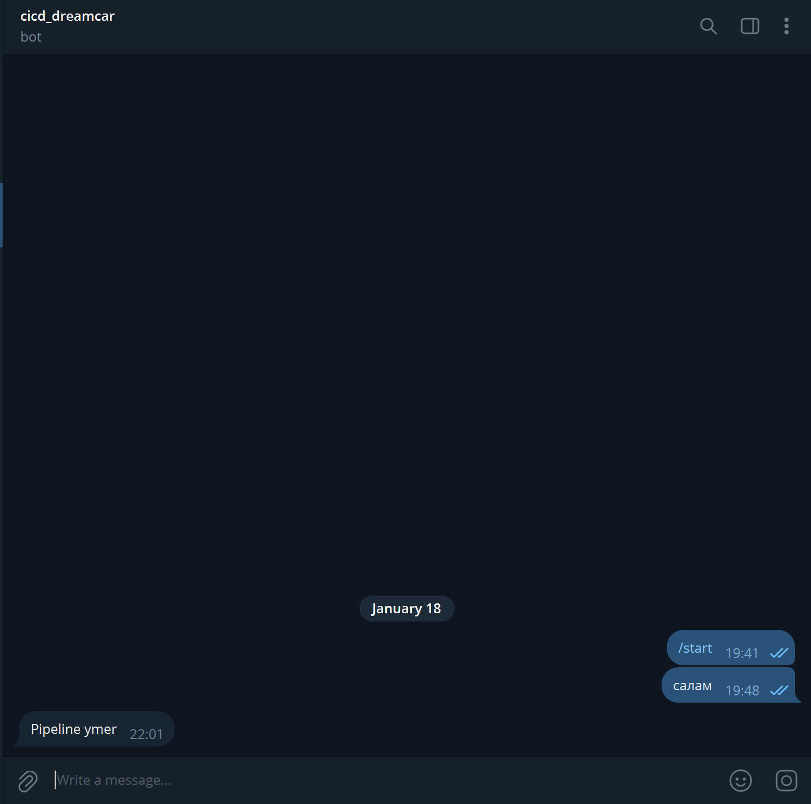

**Пайплайн завершился успешно:**  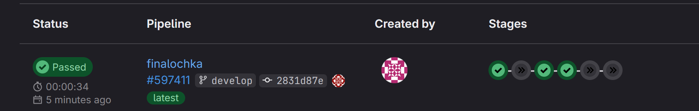
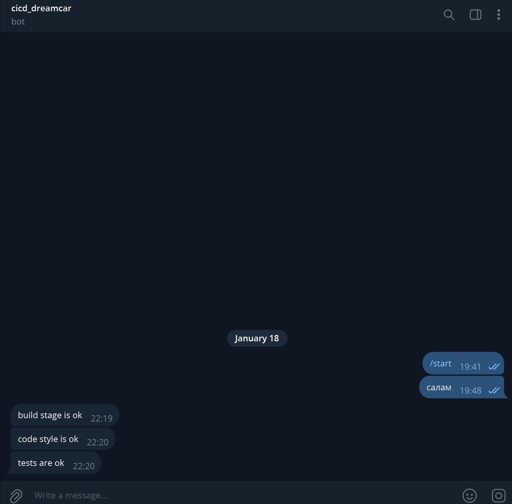
